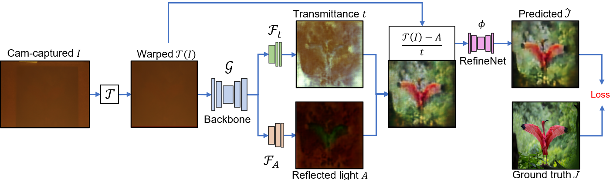
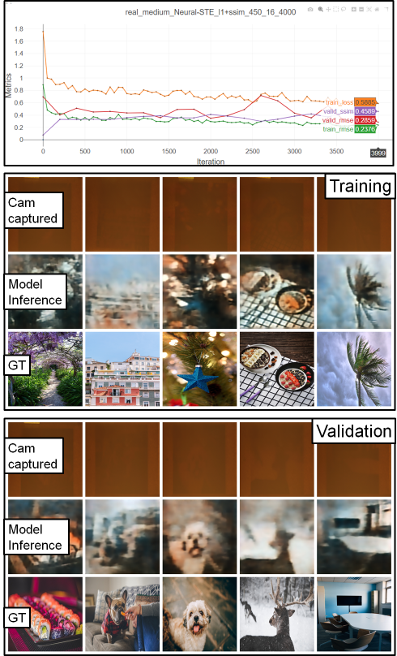

[AAAI'21] Modeling Deep Learning Based Privacy Attacks on Physical Mail
  
===

  

## Introduction
PyTorch implementation of [Neural-STE (Neural-See-Through-Envelope)][1].
Please refer to [supplementary material (~68M)][2] for more results.

----

## Prerequisites
* PyTorch compatible GPU
* Python 3
* See [requirements.txt](requirements.txt)

## Benchmark dataset
* [Real and synthetic dataset][3] (~840MB)

## Usage
### 

1. Clone this repo:
   
        git clone https://github.com/BingyaoHuang/Neural-STE
        cd Neural-STE

2. Install required packages by typing
   
        pip install -r requirements.txt
    

3. Download CompenNeSt++ [Real and synthetic dataset][3] and extract to [`data/`](data)

4. Start **visdom** by typing

        visdom -port 8098

5. Once visdom is successfully started, visit [`http://localhost:8098`](http://localhost:8098) (train locally) or `http://serverhost:8098` (train remotely).
6. Open [`train_Neural-STE.py`](src/python/train_Neural-STE.py) and set which GPUs to use. An example is shown below, we use GPU 0, 2 and 3 to train the model.
   
        os.environ['CUDA_VISIBLE_DEVICES'] = '0, 2, 3'
        device_ids = [0, 1, 2]

7. Run [`train_Neural-STE.py`](src/python/train_Neural-STE.py) to start training and testing

        cd src/python
        python train_Neural-STE.py
8. The training and validation results are updated in the browser during training. An example is shown below, where the 1st figure shows the training and validation loss, rmse and ssim curves. The 2nd and 3rd montage figures are the training and validation pictures, respectively. In each montage figure, the **1st rows are the camera-captured envelope (I), the 2nd rows are Neural-STE inferred hidden content (\hat{J}) and the 3rd rows are ground truth of the hidden content (J)**. 
9. The quantitative comparison results will be saved to `log/%Y-%m-%d_%H_%M_%S.txt` after training.
   

  

If you use the dataset or this code, please consider citing our work
## Citation
    @inproceedings{huang2021Neural-STE,
        title={Modeling Deep Learning Based Privacy Attacks on Physical Mail},
        author={Bingyao Huang and Ruyi Lian and Dimitris Samaras and Haibin Ling},
        booktitle = {AAAI Conference on Artificial Intelligence (AAAI)},
        year={2021}
    }

## Acknowledgments
The PyTorch implementation of SSIM loss is modified from [Po-Hsun-Su/pytorch-ssim](https://github.com/Po-Hsun-Su/pytorch-ssim).
We thank the anonymous reviewers for valuable and inspiring comments and suggestions.
We thank the authors of the colorful textured sampling images. 

## License
This software is freely available for non-profit non-commercial use, and may be redistributed under the conditions in [license](LICENSE).

[1]: https://bingyaohuang.github.com/pub/Neural-STE
[2]: https://vision.cs.stonybrook.edu/~bingyao/pub/Neural-STE_supp
[3]: https://bingyaohuang.github.com/pub/Neural-STE/data

